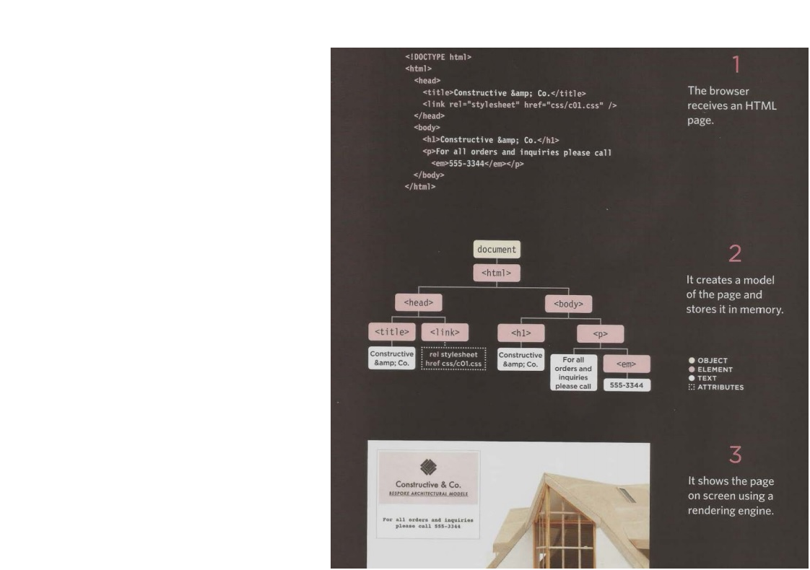

# A little about HTML CSS JS

**Browsers** People access websites using software called
**Web Servers** When you ask your browser for a web page, the request is sent across the Internet to a special computer known as a web server which hosts the website.
**How the Web Works** When you visit a website, the web server hosting that site could be anywhere in the world. In order for you to find the location of the web server, your browser will first connect to a Domain Name System (DNS) server.
**Tags** *HTML USES TAGS* act like containers. They tell you something about the information that lies between their opening and closing tags.[1]
* opening tag `
`
* closing tag `
`

**Attributes** provide additional information about the contents of an element. They appear on the opening tag of the element and are made up of two parts: a name and a value, separated by an equals sign.
``
Here the attributes is(targit="_blank") 
[5]

*we can write comments in HTML e that will not be visible in the user's browser, you can add the text between `<!--  --!>`*

**ID attribute** Every HTML element can carry the id attribute it`s *globle attribute*. It is used to uniquely identify that element from other elements on the page.Its value should start with a letter or an underscore (not a number or any other character)

**Class attribute** The class attribute on any element can share the same value.Sometimes, rather than uniquely identifying one element within a document, you will want a way to identify several elements as being different from the other elements on the page. For example, you might have some paragraphs of text that contain information that is more important than others and want to distinguish these elements, or you might want to differentiate between links that point to other pages on your own site and links that point to external sites.[1]

**inline element**
1. don`t add any break
2. don`t respect width & height
3. respect padding & margin {just left & right}

**block element**
1. take full width if no width
2. add line break
3. respect all margin padding width & height

`
`  allows you to group a set of elements together in one block-level box.you might create a `
` element to contain comments from visitors or  contain all of the elements for the header of your site (the logo and the navigation).

`` It is used to  can control the appearance of the content of these elements using CSS. we use *id or class* in span : *To explain the purpose of this`` element &
 So that CSS styles can be applied to elements that have specific values for these attributes

 `<iframe>` is like a little window that has been cut into your page and in that window you
can see another page attribute you need to know *src height width scrolling frameborder seamless*
 
 `<meta>` inside the `<head>` element and contains information about that web page.

 **Escape Characters** There are some characters that are used in and reserved by HTML code. (For example, the left and right angled brackets.)[1]
 |characters|code    |              
 |----------|--------|
 |      ©   |`&copy;`|
 |      &   |`&amp;` | 
 |      <   |`&lt;`  |
 |      >   |`&gt;`  |

**New Html5 Layout Elements** For a long time, web page authors used `
` elements to group together related elements on the page .now we use `<header> <footer> <aside> <article> <nav> <section>`
Older browsers that do not know the new HTML5 elements will automatically treat them as inline elements. Therefore, to help older browsers, you should include the line of CSS on the
left which states which new elements should be rendered as block-level elements.[1]

**Process & Design who is the site for?**
Every website should be designed for the target audience—not just for yourself or the site owner. It is therefore very important to understand who your target audience is.

Target Audience: individuals
* What is the age range of your target audience?
* Will your site appeal to more women or men? What is the mix?
* Which country do your visitors live in?
* Do they live in urban or rural areas?
* What is the average income of visitors?
* What level of education do they have?
* What is their marital or family status?
* What is their occupation?
* How many hours do they work per week?
* How often do they use the web?
* What kind of device do they use to access the web?

Target Audience: Companies
* What is the size of the company or relevant department?
* What is the position of people in the company who visit your site?
* Will visitors be using the site for themselves or for someone else?
* How large is the budget they control?
![Example Site Map[4]](https://blog.hubspot.com/hs-fs/hubfs/dyno-mapper-sitemap-generator.png?width=566&name=dyno-mapper-sitemap-generator.png)

A **wireframe** is a simple sketch of the key information that needs to go on each page of a
site. It shows the hierarchy of the information and how much space it might require.

![wireframe[4]](https://www.freepik.com/blog/app/uploads/2019/05/how-use-wireframes-web-design-Cover-post-100.jpg)

**Visual hierarchy** Most web users do not read entire pages. Rather, they skim to find information. You can use contrast to create a visual hierarchy that gets across your key message and helps users find what they are looking for.
* size
* color
* style

**grouping and Similarity**
When making sense of a design, we tend to organize visual elements into groups. Grouping related pieces of information together can make a design easier to comprehend. Here are some ways this can be achieved.
* Proximity : When several items are placed close together
* Closure : When faced with a complicated arrangement of items
* Continuance : When elements are placed in a line or a curve then they are perceived to be more related
* White Space : Placing related items closer together and leaving a bigger gap between unrelated items.
* color : A background color placed behind related items to emphasize their connection.
* Borders : A line can be drawn around the border of the group or between it and its neighbors.[1]

![Visual hierarchy[2]](https://webdesigntips.blog/wp-content/uploads/2018/11/Hack-Your-Way-To-Great-Design-Basic-Design-Principles-for-WordPress-Developers.png)

**Designing Navigation**Site navigation not only helps people find where they want to go, but also helps them understand what your site is about and how it is organized. Good navigation tends to follow these principles...
* Concise
* Clear 
* Selective
* Context
* Interactive
* Consistent

A **script** is a series of instructions that a computer can follow to achieve a goal. 
To *write a script*, you need to first state your goal and then list the tasks that need to be completed in order to achieve it.
> Start with the big picture of what you want to achieve, and break that down into smaller steps. 
1. DEFINE THE GOAL : You can think of this as a puzzle for the computer to solve.
2. DESIGN THE SCRIPT : This can be represented using a flowchart.
3. CODE EACH STEP : Each of the steps needs to be written in a programming language that the computer understands.[3]

## OBJECTS (THINGS)
In computer programming, each physical thing in the world can be represented as an object. There are two different types of objects here: a hotel and a car. Programmers might say that there is one instance of the hotel object, and two instances of the car object. Each object can have its own:
• Properties
• Events
• Methods
Together they create a working model of that object.[3]
 
## PROPERTIES (CHARACTERISTICS)
Both of the cars share common characteristics. In fact, all cars have a make, a color, and engine size. You could even determine their current speed. Programmers call these characteristics the properties of an object.
Each property has a name and a value, and each of these name/value pairs tells you something about each individual instance of the object. 

how a browser sees a web page ?
1. *receive a page as html* CODE Each page on a website can be seen as a separate document . So, the web consists of many sites, each made up of one or more documents.
2. *create a model of the page and store it in memory* 
3. *use a rendering engine to show the page on screen*
The *interpreter* takes your instructions (in JavaScript) and translates them into instructions the browser can use to achieve the tasks you want it to perform.

When you want to use JavaScript with a web page, you use the HTML`` tags
(but it is better to put scripts in their own files).[3]

### Short test
1. what is the tags & give example ?
2. what is the attribute & give example ?
3. what is the difference between id & class ?
4. explane how js worke ?
### refrences:
1. HTML & CSS Design and Build Websites Jon Ducket
2. https://webdesigntips.blog/wordpress/themes/hack-your-way-to-great-design-basic-design-principles-for-wordpress-developers/
3. JAVASCRIPT & JQUERY Interactive Front-End Web Development JON DUCKETT 
4. https://www.freepik.com/blog/how-use-wireframes-web-design/
5. http://alolsen.net/blogs/webdesign/html/html-attributes/

